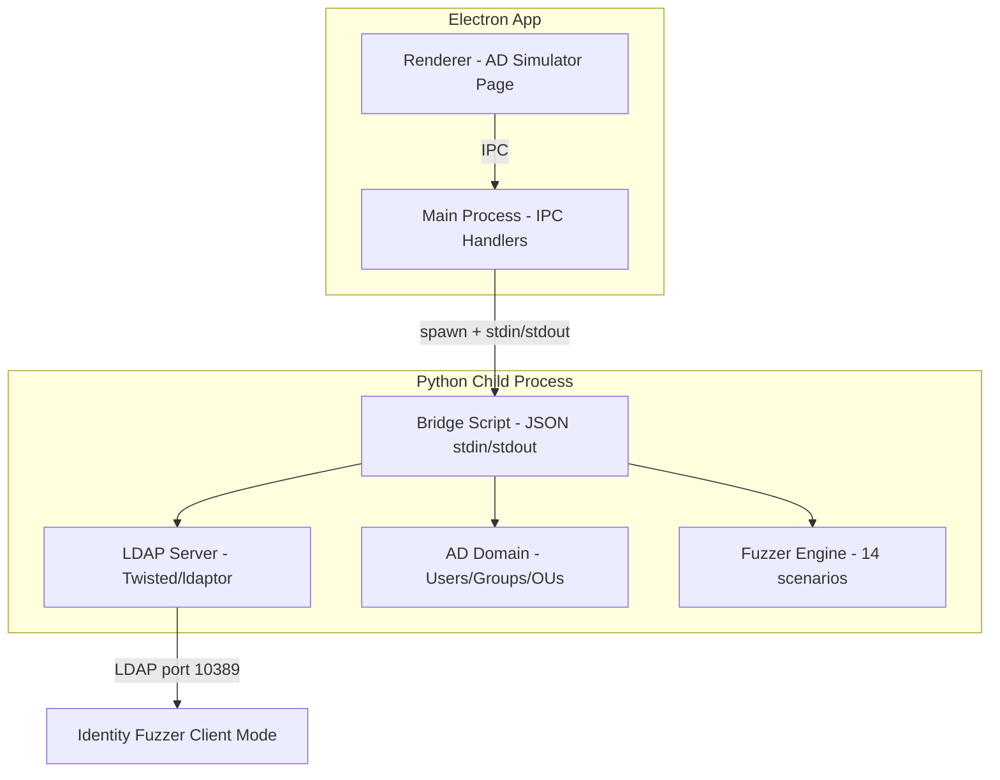

# AD Simulator Integration Plan

## Overview

Integrate the AD Simulator (Python/Twisted/ldaptor) into the Identity Fuzzer (Node.js/Electron) as a new sidebar page called "AD Simulator". This gives users a built-in Active Directory simulator they can use as a realistic LDAP target for fuzzing, or as a standalone AD testing tool.

## Architecture Decision

### Approach: Spawn Python AD Simulator as a Child Process

The AD Simulator is a full Python application with Twisted reactor, ldaptor protocol, and complex AD domain logic. Rather than rewriting ~3000 lines of Python in Node.js, we'll:

1. **Bundle the AD Simulator Python source** into the Identity Fuzzer project under `lib/ad-simulator/`
2. **Spawn it as a child process** from Electron's main process using `child_process.spawn('python3', ...)`
3. **Communicate via a JSON-over-stdin/stdout protocol** for control commands (start/stop server, manage users/groups, run fuzzer)
4. **The LDAP server runs natively** on the configured port, accessible by the Identity Fuzzer's client mode



### Why Not Rewrite in Node.js?

- The AD Simulator uses **ldaptor** (Twisted-based LDAP protocol) which has no Node.js equivalent with the same fidelity
- **3000+ lines of Python** with complex AD schema, DN parsing, filter evaluation, group membership sync
- The Python version is **already tested** with 100+ test cases
- Spawning a child process is the standard Electron pattern for integrating external tools

## Integration Components

### 1. Python Bridge Script (`lib/ad-simulator/bridge.py`)

A thin JSON-RPC-like bridge that reads commands from stdin and writes responses to stdout:

```
Commands:
  {"cmd": "start", "config": {...}}     → Start LDAP server
  {"cmd": "stop"}                        → Stop LDAP server
  {"cmd": "status"}                      → Get server status
  {"cmd": "seed", "users": 20}           → Seed directory with test data
  {"cmd": "list-users"}                  → List all users
  {"cmd": "add-user", "data": {...}}     → Add a user
  {"cmd": "list-groups"}                 → List all groups
  {"cmd": "add-group", "data": {...}}    → Add a group
  {"cmd": "add-member", ...}             → Add member to group
  {"cmd": "fuzz-list"}                   → List fuzz scenarios
  {"cmd": "fuzz-run", "scenarios": [...]}→ Run fuzz scenarios
  {"cmd": "save", "path": "..."}         → Save directory state
  {"cmd": "load", "path": "..."}         → Load directory state
  {"cmd": "get-log", "limit": 100}       → Get operation log
```

### 2. Electron Main Process Handlers (`main.js` additions)

New IPC handlers for AD Simulator operations:
- `ad-sim-start` — Spawn Python process, start LDAP server
- `ad-sim-stop` — Stop server, kill Python process
- `ad-sim-status` — Check if server is running
- `ad-sim-seed` — Seed directory with test data
- `ad-sim-users` — CRUD operations for users
- `ad-sim-groups` — CRUD operations for groups
- `ad-sim-fuzz` — Run built-in fuzz scenarios
- `ad-sim-save` / `ad-sim-load` — Persist/restore directory state
- `ad-sim-log` — Get operation log
- `ad-sim-connect-fuzzer` — Connect Identity Fuzzer client to AD Simulator

### 3. Renderer Page (`renderer/ad-simulator.html` or section in `index.html`)

New page accessible from sidebar with tabs:
- **Server Control** — Domain config (domain name, base DN, ports), start/stop, status indicator
- **Directory Browser** — Tree view of users/groups/OUs, add/edit/delete forms
- **Group Management** — Create groups, manage members, view nesting
- **Fuzzer** — Run AD Simulator's built-in 14 fuzz scenarios
- **Connection Log** — View LDAP operations received by the server
- **Quick Connect** — One-click button to run Identity Fuzzer's 149 scenarios against the AD Simulator

### 4. Sidebar Navigation

Add "AD Simulator" button to sidebar in `renderer/index.html`:
```html
<button class="nav-btn" id="adSimNavBtn" data-page="adsim">
  <span class="nav-icon">🏢</span>
  <span class="nav-label">AD Simulator</span>
</button>
```

### 5. Python Source Files to Bundle

Copy from `/Users/asrivastav/AI-Agent/anton/apps/useridd/adsimulator/`:
```
lib/ad-simulator/
├── bridge.py                    # NEW: JSON stdin/stdout bridge
├── requirements.txt             # ldaptor, twisted, pydantic, cryptography
├── src/ad_simulator/
│   ├── __init__.py
│   ├── config.py
│   ├── ad/
│   │   ├── __init__.py
│   │   ├── domain.py
│   │   ├── users.py
│   │   ├── groups.py
│   │   └── ous.py
│   ├── directory/
│   │   ├── __init__.py
│   │   ├── dit.py
│   │   ├── entry.py
│   │   ├── dn.py
│   │   ├── filters.py
│   │   └── schema.py
│   ├── server/
│   │   ├── __init__.py
│   │   ├── ldap_server.py
│   │   ├── runner.py
│   │   └── ssl_config.py
│   ├── fuzzer/
│   │   ├── __init__.py
│   │   ├── engine.py
│   │   ├── generators.py
│   │   └── scenarios.py
│   └── utils/
│       ├── __init__.py
│       ├── seed_data.py
│       └── persistence.py
└── certs/
    ├── testlab.local.crt
    └── testlab.local.key
```

## Prerequisites Check

The AD Simulator requires Python 3.11+ with pip. The Electron app will:
1. Check if `python3` is available on PATH
2. Check if required packages are installed
3. Offer to install them via `pip install -r requirements.txt`
4. Show clear error messages if Python is not available

## Implementation Order

1. Copy Python source files into `lib/ad-simulator/`
2. Create `bridge.py` — JSON stdin/stdout communication bridge
3. Add sidebar button and page structure to `renderer/index.html`
4. Add AD Simulator page JavaScript to `renderer/app.js` or new `renderer/ad-simulator.js`
5. Add CSS styles for AD Simulator page
6. Add IPC handlers in `main.js` for spawning/managing Python process
7. Add preload API extensions in `preload.js`
8. Test end-to-end: start AD Simulator → seed data → run fuzzer against it
9. Add "Quick Connect" feature to run Identity Fuzzer scenarios against AD Simulator

## UI Mockup

```
┌─────────────────────────────────────────────────────────────┐
│ 🛡️ Identity Fuzzer                                          │
├──────┬──────────────────────────────────────────────────────┤
│      │ AD Simulator                                         │
│ LDAP │ ┌──────────────────────────────────────────────────┐ │
│      │ │ Domain: testlab.local    Port: 10389  [▶ Start]  │ │
│ ──── │ │ Base DN: DC=testlab,DC=local    SSL: 10636       │ │
│      │ │ Status: ● Running    Users: 25   Groups: 6       │ │
│  🏢  │ └──────────────────────────────────────────────────┘ │
│  AD  │                                                      │
│ Sim  │ ┌─ Server ─┬─ Directory ─┬─ Groups ─┬─ Fuzzer ─┐   │
│      │ │          │             │          │          │   │
│      │ │ [Seed 20 Users]  [Save State]  [Load State]  │   │
│      │ │                                              │   │
│      │ │ Users (25)                                    │   │
│      │ │ ├── Administrator                             │   │
│      │ │ ├── svc-panos                                 │   │
│      │ │ ├── john.smith                                │   │
│      │ │ ├── jane.doe                                  │   │
│      │ │ └── ...                                       │   │
│      │ │                                              │   │
│      │ │ [+ Add User]  [Run Fuzzer Against This →]    │   │
│      │ └──────────────────────────────────────────────┘   │
└──────┴──────────────────────────────────────────────────────┘
```
