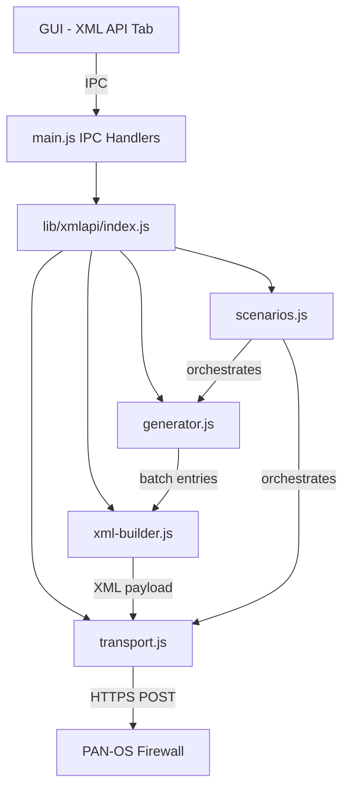
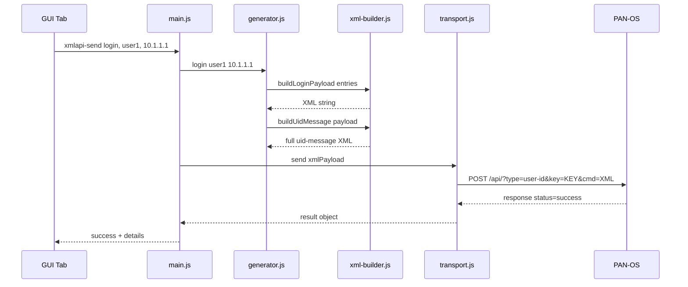

# XML API User-ID Module — Architecture Plan

## Overview

Add a new `lib/xmlapi/` module to the Identity Fuzzer that enables IP-user mapping operations via the PAN-OS XML API. This complements the existing syslog-based User-ID sender by providing the XML API alternative — the same mechanism used by User-ID agents, GlobalProtect, and third-party integrations.

## PAN-OS XML API Background

PAN-OS exposes a User-ID XML API endpoint at:
```
https://<firewall>/api/?type=user-id
```

Authentication is via API key (passed as `&key=<api-key>` query parameter or `X-PAN-KEY` header). The body is a `cmd=<uid-message>...</uid-message>` POST payload.

### XML Payload Structure

```xml
<uid-message>
  <version>2.0</version>
  <type>update</type>
  <payload>
    <login>
      <entry name="DOMAIN\username" ip="10.1.1.1" timeout="60"/>
    </login>
    <logout>
      <entry name="DOMAIN\username" ip="10.1.1.1"/>
    </logout>
    <groups>
      <entry name="cn=vpn users,cn=users,dc=testlab,dc=local">
        <members>
          <entry name="DOMAIN\user1"/>
          <entry name="DOMAIN\user2"/>
        </members>
      </entry>
    </groups>
    <hip-report>
      <entry ip="10.1.1.1" user="DOMAIN\username" domain="DOMAIN" computer="WORKSTATION1">
        <hip-report-entry>...</hip-report-entry>
      </entry>
    </hip-report>
    <tag>
      <register>
        <entry ip="10.1.1.1">
          <tag>
            <member>tag1</member>
            <member>tag2</member>
          </tag>
        </entry>
      </register>
      <unregister>
        <entry ip="10.1.1.1">
          <tag>
            <member>tag1</member>
          </tag>
        </entry>
      </unregister>
    </tag>
  </payload>
</uid-message>
```

### Key Operations

| Operation | XML Element | Description |
|-----------|------------|-------------|
| Login | `<login><entry name= ip= timeout=/>` | Create IP-to-user mapping |
| Logout | `<logout><entry name= ip=/>` | Remove IP-to-user mapping |
| Groups | `<groups><entry name=><members>...` | Push group membership |
| Tag Register | `<tag><register><entry ip=><tag>...` | Register IP tags for Dynamic Address Groups |
| Tag Unregister | `<tag><unregister>...` | Remove IP tags |

## Architecture



## Module Structure

```
lib/xmlapi/
├── constants.js      # API endpoints, defaults, payload types
├── xml-builder.js    # XML payload construction
├── transport.js      # HTTPS transport with API key auth
├── generator.js      # Batch IP-user mapping generation
├── scenarios.js      # Test scenarios
└── index.js          # Re-exports
```

## File Specifications

### 1. `lib/xmlapi/constants.js`

```javascript
// Constants
const DEFAULT_API_PORT = 443;
const API_ENDPOINT = '/api/';
const UID_MESSAGE_VERSION = '2.0';
const UID_MESSAGE_TYPE = 'update';

const PAYLOAD_TYPE = {
  LOGIN: 'login',
  LOGOUT: 'logout',
  GROUPS: 'groups',
  TAG_REGISTER: 'tag-register',
  TAG_UNREGISTER: 'tag-unregister',
};

const SCENARIO_STATUS = { IDLE, RUNNING, DONE, ERROR };
```

### 2. `lib/xmlapi/xml-builder.js`

Core XML construction. No external XML library needed — template literals are sufficient for the simple, well-defined PAN-OS schema.

**Key functions:**
- `buildLoginPayload(entries)` — entries: `[{username, ip, domain, timeout}]`
- `buildLogoutPayload(entries)` — entries: `[{username, ip, domain}]`
- `buildGroupPayload(groups)` — groups: `[{groupDn, members: [username]}]`
- `buildTagRegisterPayload(entries)` — entries: `[{ip, tags: [string]}]`
- `buildTagUnregisterPayload(entries)` — entries: `[{ip, tags: [string]}]`
- `buildUidMessage(payloadXml)` — wraps in `<uid-message>` envelope
- `buildMultiPayload(opts)` — combines login+logout+groups+tags in one message

Each function returns a string of XML. The `buildUidMessage` wrapper adds version and type.

### 3. `lib/xmlapi/transport.js`

HTTPS transport to PAN-OS XML API.

**Class: `XmlApiTransport`**
- `constructor()` — initializes state, stats
- `connect(host, port, opts)` — stores connection params (API key, verify SSL, cert/key)
  - `opts.apiKey` — required API key
  - `opts.verify` — verify server cert (default: false)
  - `opts.certFile`, `opts.keyFile`, `opts.caFile` — optional mTLS
- `send(xmlPayload)` — POST to `/api/?type=user-id&key=<key>&cmd=<xml>`
  - Returns parsed response `{status, message, code}`
  - Handles PAN-OS XML response parsing
- `disconnect()` — cleanup
- `stats` — TransportStats instance

**Response parsing:** PAN-OS returns:
```xml
<response status="success"><msg>...</msg></response>
```
or
```xml
<response status="error" code="..."><msg><line>error detail</line></msg></response>
```

### 4. `lib/xmlapi/generator.js`

**Class: `XmlApiGenerator`**

Mirrors the syslog `MessageGenerator` pattern:
- `login(username, ip, opts)` — single login entry
- `logout(username, ip, opts)` — single logout entry
- `batchLogin(opts)` — generate N login entries with sequential IPs
- `batchLogout(opts)` — generate N logout entries
- `groupUpdate(groupDn, members)` — group membership push
- `tagRegister(ip, tags)` — register tags on IP
- `tagUnregister(ip, tags)` — unregister tags from IP

Uses the existing `IPGenerator` from `lib/syslog/ip-generator.js`.

### 5. `lib/xmlapi/scenarios.js`

Test scenarios following the syslog pattern:

| Scenario | Description |
|----------|-------------|
| `login-logout` | Send login mappings, pause, send logout |
| `bulk-login` | Send large batch of logins in chunks (PAN-OS limit: ~500 entries per message) |
| `group-push` | Push group membership via XML API |
| `tag-register` | Register dynamic tags on IPs |
| `mixed` | Combined login + group + tag in single payload |
| `edge-cases` | Unicode usernames, long domains, max entries, empty payloads |

Each scenario returns a result object matching the syslog pattern:
```javascript
{ scenario, status, messagesSent, loginCount, logoutCount, errors, details }
```

### 6. `lib/xmlapi/index.js`

Re-exports all public APIs, matching the syslog module pattern.

## Integration Points

### main.js — IPC Handlers

New handlers following the syslog pattern:

```javascript
ipcMain.handle('xmlapi-send', async (_event, opts) => { ... });
ipcMain.handle('xmlapi-bulk', async (_event, opts) => { ... });
ipcMain.handle('xmlapi-scenario', async (_event, opts) => { ... });
ipcMain.handle('xmlapi-stop', () => { ... });
```

### preload.js — Bridge API

```javascript
contextBridge.exposeInMainWorld('xmlapi', {
  send: opts => ipcRenderer.invoke('xmlapi-send', opts),
  bulk: opts => ipcRenderer.invoke('xmlapi-bulk', opts),
  scenario: opts => ipcRenderer.invoke('xmlapi-scenario', opts),
  stop: () => ipcRenderer.invoke('xmlapi-stop'),
  onProgress: cb => { ... },
  onLog: cb => { ... },
  onResult: cb => { ... },
});
```

### renderer/index.html — New Nav Button + Page

Add a 4th nav button:
```html
<button class="nav-btn" id="xmlapiNavBtn" data-page="xmlapi">
  <span class="nav-icon">🔑</span>
  <span class="nav-label">XML API</span>
</button>
```

New page with tabs:
- **Send** — Single login/logout/group/tag operation
- **Bulk** — Batch operations with configurable count
- **Scenarios** — Pre-built test scenarios
- **Log** — Operation log

### renderer/xmlapi-sender.js

GUI logic following the `syslog-sender.js` pattern:
- Connection panel: Firewall IP, Port, API Key, Verify SSL
- Operation panel: Operation type selector, username/IP/domain/timeout fields
- Bulk panel: Count, interval, chunk size
- Results panel: Success/error display with XML preview

## Data Flow



## PAN-OS Constraints

- **Max entries per message:** ~500 login/logout entries per `<uid-message>`
- **API key required:** Generate via `https://<fw>/api/?type=keygen&user=admin&password=admin`
- **Timeout field:** Optional on login entries; 0 = never expire, default = global setting
- **Domain format:** `DOMAIN\username` (backslash-separated)
- **Group DN format:** Full LDAP DN for group push
- **Rate limiting:** PAN-OS may throttle rapid API calls; configurable delay between chunks

## Testing Strategy

1. **Unit:** XML builder produces valid XML for each payload type
2. **Integration:** Send to real PAN-OS and verify mappings appear in `show user ip-user-mapping all`
3. **Edge cases:** Unicode, max-length usernames, IPv6, overlapping mappings
